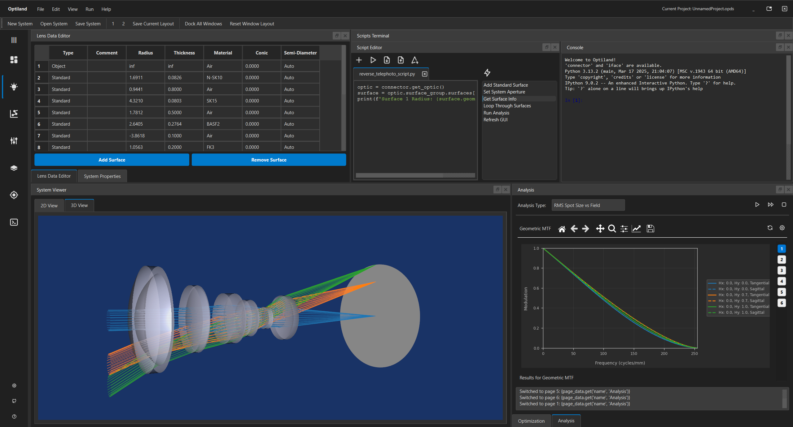

[](https://optiland.readthedocs.io/en/latest/?badge=latest)
[](https://codecov.io/github/HarrisonKramer/optiland)
[](https://codeclimate.com/github/HarrisonKramer/optiland/maintainability)

[](https://opensource.org/licenses/MIT)
[](https://doi.org/10.5281/zenodo.14588961)
[](https://img.shields.io/badge/python-3.9%20%7C%203.10%20%7C%203.11%7C%203.12%20%7C%203.13%20-blue)


<div align="center">
  <a href="https://optiland.readthedocs.io/">
    
  </a>
</div>

<div align="center">
    
  </a>
</div>

<p align="center"><em>Screenshot of Optiland’s GUI showing a reverse telephoto system.</em></p>

<!-- TABLE OF CONTENTS -->
<details>
  <summary>Table of Contents</summary>
  <ol>
    <li><a href="#introduction">Introduction</a></li>
    <li><a href="#documentation">Documentation</a></li>
    <li><a href="#installation">Installation</a></li>
    <li><a href="#key-features">Functionalities</a></li>
    <li><a href="#learning-guide">Functionalities</a></li>
    <li><a href="#roadmap">Roadmap</a></li>
    <li><a href="#license">License</a></li>
    <li><a href="#contact-and-support">Contact and Support</a></li>
  </ol>
</details>

---

## Introduction

**Optiland** provides a flexible Python interface for optical system design—whether you're tracing rays through traditional lenses or training differentiable models with PyTorch. It supports both classical engineering workflows and cutting-edge research needs, and includes a powerful graphical interface for interactive design and analysis (see above).

It lets you:

- ⚙️ Build lens and mirror systems with a clean, object-oriented API  
- 🔍 Trace rays through multi-surface optical assemblies, including aspherics and freeforms
- 📊 Analyze paraxial properties, wavefront errors, PSFs/MTFs, and scatter behavior 
- 🧠 Optimize via traditional merit functions *or* autograd-enabled differentiable backends  
- 🎨 Visualize interactively in 2D (Matplotlib) and 3D (VTK)

Under the hood, Optiland uses **NumPy** for fast CPU calculations and **PyTorch** for GPU acceleration and automatic differentiation. Switch between engines depending on your use case—with the same interface.

🚀 **Quickstart**  
1. 🌟 [Quickstart Tutorial](https://optiland.readthedocs.io/en/latest/examples/Tutorial_1a_Optiland_for_Beginners.html) – build your first lens in 5 minutes  
2. 📚 [Full Learning Guide](https://optiland.readthedocs.io/en/latest/learning_guide.html) – in-depth guide to mastering Optiland 
3. 🖼️ [Example Gallery](https://optiland.readthedocs.io/en/latest/gallery/introduction.html) – visual showcase of designs and core features
4. 📝 [Cheat Sheet](https://optiland.readthedocs.io/en/latest/cheat_sheet.html) - an up-to-date cheat sheet to get you started ASAP with your first optical system

---

## Documentation

Optiland's full documentation is available on [Read the Docs](https://optiland.readthedocs.io/).

Whether you're just getting started or exploring advanced features, here are the best entry points:

- **🔍 Quick Start**: The [Cheat Sheet](https://optiland.readthedocs.io/en/latest/cheat_sheet.html) offers a concise overview of core concepts and commands.
- **🧪 Example Gallery**: Browse the [Gallery](https://optiland.readthedocs.io/en/latest/gallery/introduction.html) for real-world lens designs, visualizations, and analysis workflows using Optiland.
- **🛠️ Developer Resources**:  
  - The [Developer's Guide](https://optiland.readthedocs.io/en/latest/developers_guide/introduction.html) explains the internal architecture and design of Optiland.  
  - The [API Reference](https://optiland.readthedocs.io/en/latest/api/api_introduction.html) provides detailed documentation for all public classes, functions, and modules.


## Installation

- **Core only**

    ```bash
    pip install optiland
    ```

- **With CPU‑only PyTorch**

    ```bash
    pip install optiland[torch]
    ```

- **GPU‑enabled PyTorch**

    - After installing Optiland, install a CUDA build of PyTorch manually:

    ```bash
    pip install optiland
    pip install torch torchvision torchaudio --index-url https://download.pytorch.org/whl/cu118
    ```


For more details, see the [installation guide](https://optiland.readthedocs.io/en/latest/installation.html) in the docs.

## Key Features at a Glance

| Feature Category       | Capabilities |
|------------------------|--------------|
| **🛠️ Design & Modeling** | Build systems using spherical, aspheric, conic, and freeform surfaces. Configure fields, wavelengths, apertures. |
| **🧮 Differentiable Core** | Switch between NumPy (CPU) and PyTorch (GPU/autograd) seamlessly for hybrid physics-ML workflows. |
| **🔬 Ray Tracing** | Trace paraxial and real rays through sequential systems with support for polarization, birefringence, and coatings. |
| **📊 Optical Analysis** | Generate spot diagrams, wavefront error maps, ray fans, PSF/MTF plots, Zernike decompositions, distortion plots, etc. |
| **🧠 Optimization** | Local & global optimizers, autograd support, operand-based merit functions, and GlassExpert for categorical variable search. |
| **📈 Tolerancing** | Monte Carlo and parametric sensitivity analysis to evaluate robustness and manufacturability. |
| **📚 Material Library** | Integrated access to refractiveindex.info. Support for custom dispersion models and material creation. |
| **🖼️ Visualization** | 2D plots via matplotlib, 3D interactive scenes with VTK, and debugging tools to inspect ray behavior. |
| **🧩 Interoperability** | Import Zemax files, save/load systems in JSON, use full Python API for scripting and automation. |
| **🚀 Performance** | GPU-accelerated ray tracing (150M+ ray-surfaces/s), Numba-optimized NumPy backend, JIT-compiled computations. |
| **🤖 ML Integration** | Compatible with PyTorch pipelines for deep learning, differentiable modeling, and end-to-end training. |


> ✨ For a full breakdown of Optiland’s functionalities, see the [complete feature list](https://optiland.readthedocs.io/en/latest/functionalities.html).

> [!NOTE]
> The code itself is in constant flux and new functionalities are always being added.

## Learning Guide

Optiland has a rich set of tutorials and guides to help you learn optical design, analysis, and optimization step-by-step.

👉 **[View the Learning Guide »](https://optiland.readthedocs.io/en/latest/learning_guide.html)**  

## Roadmap

Optiland is continually evolving to provide new functionalities for optical design and analysis. Below are some of the planned features and enhancements we aim to implement in future versions:

- [x] **GUI (PySide6-based)** - *Initial version available, ongoing enhancements.*
- [ ] **Multi-Path Sequential Ray Tracing**
- [ ] **Multiple Configurations (Zoom Lenses)**
- [ ] **Thin Film Design and Optimization** 
- [ ] **Diffractive Optical Elements**
- [ ] **Additional Backends: JAX, CuPy**
- [ ] **Jones Pupils**
- [ ] **Apodization Support** 
- [ ] **Additional Freeforms (Superconic, etc.)**
- [ ] **Image Simulation**
- [ ] **Huygens MTF**
- [ ] **Interferogram Analysis**
- [ ] **Additional Tutorials/Examples**
- [ ] **Non-sequential ray tracing**
- [ ] **Insert your idea here...**


### Community Contributions
We welcome suggestions for additional features! If there's something you'd like to see in Optiland, feel free to open an issue or discussion.


## License
Distributed under the MIT License. See [LICENSE](https://github.com/HarrisonKramer/optiland/blob/master/LICENSE) for more information.


## Contact and Support
If you have questions, find a bug, have suggestions for new features, or need help, please [open an issue](https://github.com/HarrisonKramer/optiland/issues) in the GitHub repository. This ensures that your concern is visible to others, can be discussed collaboratively, and helps build a public archive of solutions for similar inquiries in the future.

While I prefer issues as the primary means of communication, you may also contact me via email if necessary.

Kramer Harrison - kdanielharrison@gmail.com
