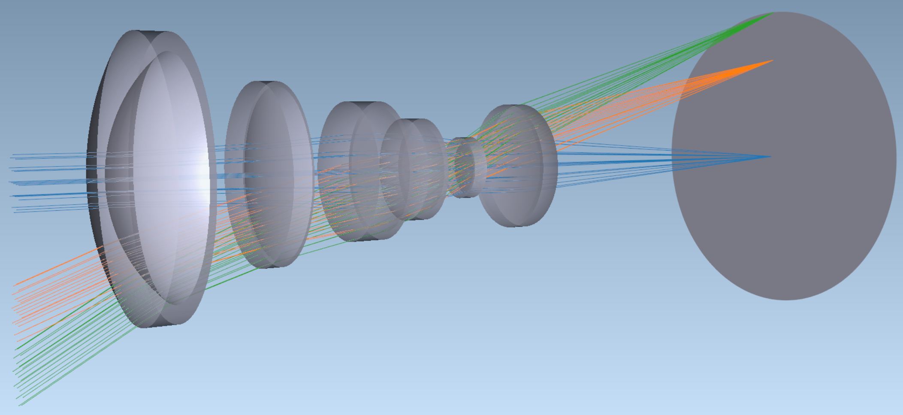

# **Optiland**

<!-- TABLE OF CONTENTS -->
<details>
  <summary>Table of Contents</summary>
  <ol>
    <li><a href="#introduction">Introduction</a></li>
    <li><a href="#installation">Installation</a></li>
    <li><a href="#functionalities">Functionalities</a></li>
    <li><a href="#learning-guide">Learning Guide</a></li>
    <li><a href="#license">License</a></li>
    <li><a href="#contact">Contact</a></li>
    <li><a href="#acknowledgements-&-references">Acknowledgements & References</a></li>
  </ol>
</details>

## Introduction
Optiland is a lens design and analysis program written in Python 3. It provides an intuitive and efficient interface for defining and visualizing lens systems, performing optimization of lens systems based on user-defined merit functions and variables, as well as analyzing optical systems using geometric and diffraction-based methods.


Get started immediately with [Optiland Tutorial #1](https://github.com/HarrisonKramer/optiland/blob/master/examples/Tutorial_1a_Optiland_for_Beginners.ipynb) or see the extensive [Learning Guide](#learning-guide).


<figure style="text-align: center;">
  
</figure>


## Installation

You can install the package using pip. To do so, follow these steps:

1. Open a terminal or command prompt.
2. Run the following command to install the package:

    ```sh
    pip install git+https://github.com/HarrisonKramer/optiland.git
    ```


## Functionalities
- Lens entry
- 2D/3D visualization
- Paraxial analysis
- Real and paraxial ray tracing
- Real analysis functions (spot diagrams, ray aberration fans, OPD fans, distortion, MTF, etc.)
- Glass catalogue and index/abbe v-number determination (based on refractiveindex.info)
- Design optimization
- Wavefront and Zernike analysis
- Coating analysis

The code itself is in constant flux and new functionalities are always being added.

## Learning Guide
This guide gives a step-by-step approach to learning how to use Optiland.

1. **Introduction to Optiland**
    - [Tutorial 1a - Optiland for Beginners](https://github.com/HarrisonKramer/optiland/blob/master/examples/Tutorial_1a_Optiland_for_Beginners.ipynb)
         - Lens entry
         - Material selection
         - Aperture, field and wavelength selection
         - Drawing a lens in 2D and 3D
    - [Tutorial 1b - Determining Lens Properties](https://github.com/HarrisonKramer/optiland/blob/master/examples/Tutorial_1b_Lens_Properties.ipynb)
        - Focal length
        - Magnification
        - F-Number, Entrance/Exit pupil sizes & positions
        - Focal, Principal, and Nodal points, etc.
    - Tutorial 1c - Monte Carlo Raytracing Methods - Update in progress
2. **Real Raytracing & Analysis**
    - [Tutorial 2a - Tracing & Analyzing Rays](https://github.com/HarrisonKramer/optiland/blob/master/examples/Tutorial_2a_Tracing_&_Analyzing_Rays.ipynb)
        - How to trace rays through a system
        - Analyzing ray paths & properties
    - [Tutorial 2b - Tilting & De-centering Components](https://github.com/HarrisonKramer/optiland/blob/master/examples/Tutorial_2b_Tilting_&_Decentering_Components.ipynb)
        - Tracing rays through misaligned components
3. **Aberrations**
    - [Tutorial 3a - Common aberration analyses/plots](https://github.com/HarrisonKramer/optiland/blob/master/examples/Tutorial_3a_Common_Aberration_Analyses.ipynb)
        - Spot diagrams
        - Ray fans
        - Y-Ybar plots
        - Distortion / Grid distortion plots
        - Field curvature plots
    - [Tutorial 3b - 1st & 3rd-Order Aberrations](https://github.com/HarrisonKramer/optiland/blob/master/examples/Tutorial_3b_First_&_Third_Order_Aberrations.ipynb)
        - Calculation of seidel, 1st & 3rd-order aberrations
    - Tutorial 3c - Chromatic Aberrations - Update in progress
        - Designing a doublet to minimize chromatic aberrations
4. **Optical Path Difference (OPD), Point Spread Functions (PSF) & Modulation Transfer Function (MTF)**
    - [Tutorial 4a - Optical Path Difference](https://github.com/HarrisonKramer/optiland/blob/master/examples/Tutorial_4a_Optical_Path_Difference_Calculation.ipynb)
        - OPD fans and plots
    - [Tutorial 4b - PSF & MTF Calculation](https://github.com/HarrisonKramer/optiland/blob/master/examples/Tutorial_4b_PSF_&_MTF_Calculation.ipynb)
        - Geometric MTF
        - FFT-based PSF/MTF
    - [Tutorial 4c - Zernike Decomposition](https://github.com/HarrisonKramer/optiland/blob/master/examples/Tutorial_4c_Zernike_Decomposition.ipynb)
        - Decomposing wavefront using Zernike polynomials
        - Coefficient types: Zernike standard, Zernike fringe, Zernike Noll
5. **Optimization**
    - [Tutorial 5a - Simple Optimization](https://github.com/HarrisonKramer/optiland/blob/master/examples/Tutorial_5a_Simple_Optimization.ipynb)
        - Operand and variable definition
        - Local optimization
    - [Tutorial 5b - Advanced Optimization](https://github.com/HarrisonKramer/optiland/blob/master/examples/Tutorial_5b_Advanced_Optimization.ipynb)
        - Global optimization
    - Tutorial 5c - Optimization Case Study - Update in progress
        - Designing a smartphone camera
6. **Coatings & Polarization**
    - Tutorial 6a - Introduction to Coatings - Update in progress
        - Coating types
        - Impact of coatings on system performance
    - Tutorial 6b - Polarization Effects - Update in progress
        - Basics of polarization in Optiland
        - Analyzing polarization performance
    - Tutorial 6c - Advanced Polarization - Update in progress
        - Waveplates, polarizers, and the Jones matrix
        - Jones pupils
7. **Advanced Optical Design**
    - Tutorial 7a - Designing a Complex System - Update in progress
    - Tutorial 7b - Surface Roughness & Scattering - Update in progress
8. **Tolerancing**
    - Tutorial 8a - Introduction to Tolerancing - Update in progress
        - Sensitivity studies
    - Tutorial 8b - Advanced Tolerancing - Update in progress
        - Monte Carlo-based Tolerancing
9. **Extending Optiland**
    - [Tutorial 9a - Custom Surface Types](https://github.com/HarrisonKramer/optiland/blob/master/examples/Tutorial_9a_Custom_Surface_Types.ipynb) - Update in progress
        - Adding new surface types
    - [Tutorial 9b - Custom Coating Types](https://github.com/HarrisonKramer/optiland/blob/master/examples/Tutorial_9b_Custom_Coating_Types.ipynb) - Update in progress
        - Adding new coating types
    - Tutorial 9c - Custom Optimization Algorithms - Update in progress
        - Adding new optimization approaches
10. **Machine Learning in Optical Design** - Update in progress


## License
Distributed under the GPL-3.0 License. See [LICENSE](https://github.com/HarrisonKramer/optiland/blob/master/LICENSE) for more information.


## Contact
Kramer Harrison - kdanielharrison@gmail.com

## Acknowledgements & References
- https://www.lens-designs.com/
- https://github.com/Sterncat/opticspy
- https://github.com/jordens/rayopt
