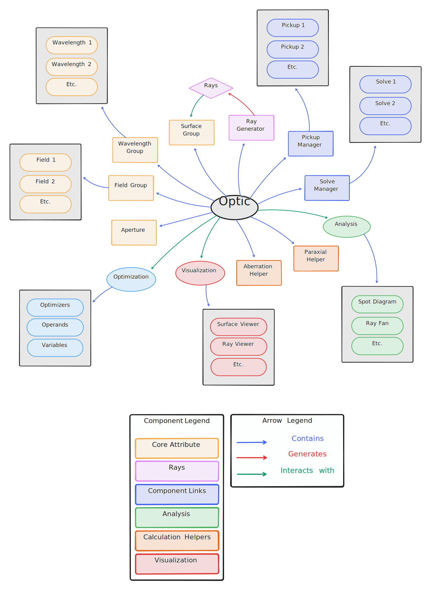

Architecture Overview
=====================

.. note:: For detailed explanations of individual components (e.g., surfaces, ray tracing, optimization), see the corresponding sections in this guide.

Core Components
---------------

The relationships between components are illustrated in the following diagram:

   Architectural diagram showing relationships between the `Optic` class, which is the core class for optical systems, and other key components like fields,
   surfaces, rays, optimization, analysis, and visualization frameworks.

This diagram is not meant to be exhaustive but provides a high-level overview of the core components and their interactions.

The `Optic` Class
------------------

The architecture is centered around the `Optic` class, which acts as the primary container for optical system definitions and
coordinates interactions between key components. It encapsulates:

- **Field Group**: A collection of defined field points for ray tracing and analysis. These define the extent of the object.
- **Wavelength Group**: The set of wavelengths used in calculations and ray tracing.
- **Surface Group**: A collection of surfaces that define the optical system.
- **Ray Generator**: A module for generating rays based on the system's parameters.
- **Paraxial Helper**: A utility for performing paraxial calculations.
- **Aberration Helper**: A utility for computing various aberration metrics.
- **Pickup and Solve Managers**: Tools for linking parameters between surfaces and solving specific system constraints.

Overview of Key Modules
-----------------------

- **Optic Class**: The central container for an optical system. It manages fields, wavelengths, surfaces, ray generation, and utility tools like paraxial calculations and aberration helpers. The `Optic` class serves as the interface for operations such as optimization, analysis, and tolerancing.
- **Surface Group**: A collection of surfaces within the `Optic` class. Each surface defines an optical interface with attributes like geometry, materials, coatings, and optional apertures.
- **Ray Tracing Framework**: Manages ray generation and propagation through the optical system, supporting real, paraxial, and polarized rays.
- **Analysis Framework**: Provides tools to evaluate system performance, such as spot diagrams, ray fans, and wavefront aberrations.
- **Optimization Framework**: Allows for system refinement based on user-defined objectives, combining operands, variables, and optimization algorithms.
- **Visualization Framework**: Offers 2D and 3D visualizations of optical components, ray paths, and system performance metrics.

Component Interactions
----------------------

The components of Optiland are designed to work seamlessly together, with the `Optic` class orchestrating most interactions:

- Rays are generated via the ray generator in the `Optic` class and traced through the system via the surface group.
- Optimization relies on surface attributes (e.g., radius of curvature) as variables and ray tracing results for evaluating operands.
- Analysis tools, such as spot diagrams and ray fans, operate on data generated by the ray tracing framework.
- Visualization modules query the state of the `Optic` class, rendering components and simulation results.
- Pickups manage the relationships between surfaces and can modify surface properties.

Extensibility
-------------

Optiland's design prioritizes extensibility:

- **New Components**: Developers can easily add new surface types, coating types, ray definitions, or analysis tools, etc. by following existing patterns.
- **Custom Optimizations**: The optimization framework supports user-defined variables and operands.
- **Visualization Customization**: Modular visualization classes allow for tailored rendering of components or results.

With this high-level understanding of Optiland's architecture, we can now dive deeper into individual components in their dedicated sections.
