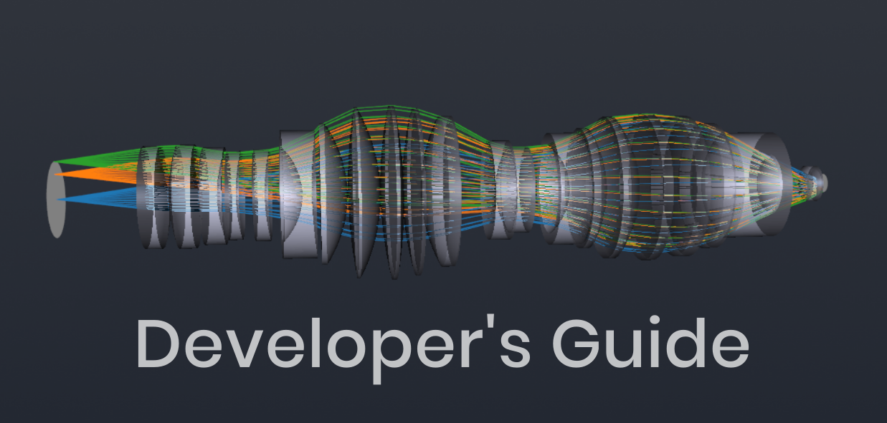

.. _developers_guide:

Introduction
============

|br|

The developer's guide is intended for users who wish to better understand and
contribute to the development of the Optiland package. It provides an overview
of the package's requirements, architecture and design, and various frameworks related
to system definition, raytracing, analysis, optimization, tolerancing, etc.   
The guide is intended to be a living document that evolves with the package.

.. |br| raw:: html

       

Purpose
-------
The goal of this guide is to demystify the structure and functionality of the Optiland codebase.
Ultimately, the guide is to intended to help end users to:

- Add new functionality with minimal friction.
- Extend existing frameworks to meet custom needs.
- Debug or improve performance-critical sections of the code.

Audience
--------
This guide is written for:

- **Open-source contributors**: Developers interested in enhancing or refining Optiland’s capabilities.
- **Optical engineers and scientists**: Users with coding expertise who want to add or customize features for specific research or designs.
- **Software developers**: Programmers who want to integrate Optiland with other projects.
- **Curious learners**: Anyone who wants to explore how Optiland works under the hood and gain insights into developing domain-specific, scientific Python packages.

We assume a basic understanding of Python, object-oriented programming, and optics principles.
Nonetheless, we strive to make the content accessible to a broad audience, regardless of their background.

Philosophy and Core Principles
------------------------------
Optiland is built with the following principles in mind:

- **Transparency and Extensibility**: The codebase is designed to be modular and well-documented, making it easy to adapt for new use cases.
- **Speed and Performance**: Built on powerful libraries like NumPy and SciPy, Optiland leverages vectorized computations and efficient algorithms to deliver fast, scalable solutions for complex optical problems.
- **Collaboration and Community**: Optiland is open-source under the MIT License, welcoming contributions from anyone with an interest in advancing optical design tools.

What to Expect in This Guide
----------------------------

Here’s a quick overview of what you’ll find in the Developer’s Guide:

- **Requirements & Installation**: Learn how to set up your development environment and install Optiland.
- **Getting Started**: Explore the codebase and run your first simulation.
- **Architecture Overview**: Learn how the Optiland codebase is structured, with a focus on its key components and design patterns.
- **Core Frameworks**: Understand the core frameworks that power Optiland, including raytracing, surfaces, analysis, optimization, visualization and tolerancing.
- **File Formats**: Understand the Optiland file format and how to read/write data to and from it.
