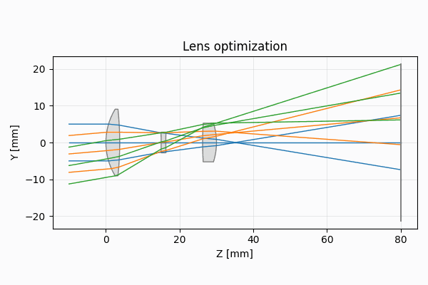
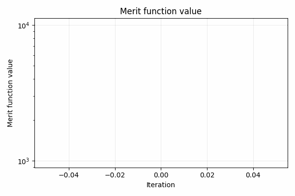
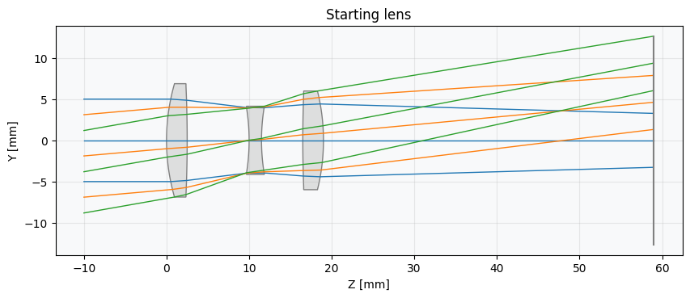
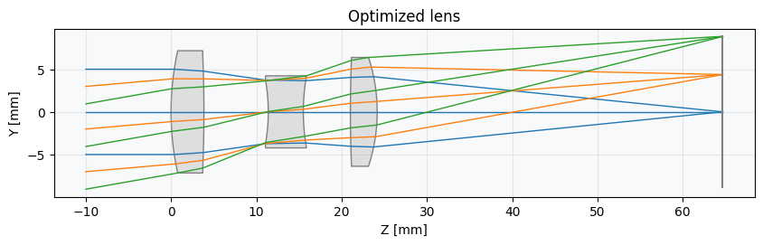

Optimization Framework
======================

Optimization in Optiland allows users to improve the performance of optical systems by adjusting design parameters to minimize
(or maximize) a merit function. The framework supports a wide range of optimizers and a flexible system for defining operands and
variables. The framework integrates tightly with the `Optic` class.

The Optiland optimization framework includes the following components:

- **Operands**: Quantitative metrics for evaluating optical system performance or properties (e.g., RMS spot size, wavefront error, etc.).
- **Variables**: System parameters that can be adjusted (e.g., surface curvatures, separations).
- **Scaling**: Methods to scale optimization variables to a (roughly) common range for improved convergence and performance.
- **Optimization Problem Class**: Encapsulates the problem definition, linking operands and variables.
- **Optimizers**: Algorithms for solving optimization problems, such as gradient-based methods or evolutionary strategies.

.. raw:: html

   

Components Explained
--------------------

1. **Optimization Problem**:

   - The `OptimizationProblem` class orchestrates the optimization process.
   - Key responsibilities include:

     - Adding **operands** to define the merit function.
     - Adding **variables** to define the parameters to optimize.
     - Computing the overall objective function value.

2. **Optimizers**:

   - A base `Optimizer` class wraps `scipy.optimize.minimize` and provides a unified interface.
   - Built-in optimizers include:

     - **Dual Annealing** (global)
     - **Differential Evolution** (global)
     - **Basin Hopping** (global)
     - **SHGO** (global)
     - **Least Squares** (local)
     - **Nelder-Mead**, **Powell**, **BFGS**, **L-BFGS-B**, **COBYLA**, etc. (local optimization, from `scipy.optimize.minimize`)
   - Users can subclass the base optimizer for custom methods.

3. **Operands and Variables**:

   - **Operands**: Define individual contributions to the merit function. Examples:

     - RMS Spot Size
     - Wavefront Error
     - Focal Length
   - **Variables**: Define the parameters to optimize, such as:

     - Radius of curvature
     - Conic constants
     - Material refractive indices
     - Surface tilts and decenters
     - Geometry parameters (e.g., freeform coefficients)

4. **Scaling**:

   - Scaling methods help improve optimization performance by normalizing variable ranges.
   - Built-in scalers include:

     - Linear Scaling
     - Logarithmic Scaling
     - Power Scaling
     - Reciprocal Scaling

.. note::
   The optimization framework is written in a modular way, allowing users to easily extend the framework with custom optimizers, operands, and variables.

.. raw:: html

   

Typical Optimization Process
----------------------------

1. **Set Up the Problem**. Create an instance of `OptimizationProblem`:

.. code:: python

   from optiland.optimization import OptimizationProblem
   problem = OptimizationProblem(optic)

2. **Add Operands**. Add operands to define the merit function:

.. code:: python

   input_data = {'optic': lens}

   # Add focal length operand
   problem.add_operand(operand_type='f2', target=50, weight=1, input_data=input_data)

3. **Add Variables**. Define the parameters to optimize:

.. code:: python

   # Add radius of curvature variable for second surface
   problem.add_variable(lens, 'radius', surface_number=2)

4. **Choose an Optimizer**. Select an optimizer and run the optimization:

.. code:: python

   from optiland.optimization import OptimizerGeneric
   optimizer = OptimizerGeneric(problem)
   result = optimizer.optimize()

5. **Review Results**. Print optimization results and visualize performance:

.. code:: python

   problem.info()  # print optimization problem details
   print(result)   # standard output from scipy.optimize.minimize
   lens.draw()     # Plot the lens in 2D

.. raw:: html

   

Understanding Operands
----------------------

Operands represent individual components of the merit function. To find the inputs required for a specific operand:

- Refer to the operand registry in the Operand module, or the API documentation.
- Use operand-specific documentation for parameter details. For example, the RMS spot size requires a field as an input, while the focal length does not. All operands require a target value, weight, and an `Optic` instance.

.. raw:: html

   

Extending Optimization
----------------------

Custom operands, variables and optimization algorithms can be added by subclassing the appropriate base classes. For example:

- Subclass VariableBehavior to create a new variable type, then register it within the Variable class.
- Define a new operand function and register it within the Operand module.
- Subclass OptimizerGeneric to create a new optimization algorithm.

.. tip::
   See the :ref:`Learning Guide <example_gallery>` for demonstrations of custom optimization algorithms and user-defined operands.

.. raw:: html

   

Categorical Optimization with Glass Expert
------------------------------------------

Optiland also includes a specialized optimizer called GlassExpert for handling problems that involve categorical variables, specifically lens materials. 
This optimizer is designed to find an optimal combination of real glasses from a catalog while simultaneously optimizing continuous lens parameters.

**Architecture**

The GlassExpert class inherits from `OptimizerGeneric` and extends its capabilities to manage material variables defined by their refractive index (n_d) and Abbe number (V_d). The core algorithm operates in phases:

1.  **Initialization**

    - The optimization problem is set up with both continuous variables (e.g., radii, thicknesses) and categorical glass variables.
    - Each glass variable is associated with a list of candidate glasses from a catalog (e.g., Schott, Ohara):

      .. code:: python

         glasses = material_utils.glasses_selection(0.4, 0.7, catalogs=["schott", "ohara"])

         problem.add_variable(lens, "material", surface_number=1, glass_selection=glasses)

    - Then the optimizer is setup with:

      .. code:: python

         optimizer = optimization.GlassExpert(problem)
         res = optimizer.run(
            num_neighbours=7,
            maxiter=100,
            tol=1e-6,
            callback=None,
            verbose=True,
            plot_glass_map=False,
         )

2.  **Global exploration**

    - For each glass variable, a broad search is performed across the entire specified glass catalog.
    - To manage the search space, the glass map (n_d vs. V_d) is often downsampled using K-Means clustering, retaining a diverse subset of materials (controlled by `pool_size`, which defaults to `num_neighbours` in the `run` method).
    - Each glass in this downsampled pool is temporarily substituted into the design.

    .. figure:: ../_static/glass_map_global_exploration_space.png
      :width: 60%
      :align: center

      Map of the (nd,vd) glass space and selected candidates for global search.

3.  **Local exploration**

    - After the global exploration, a focused search is conducted around the current best-performing glasses.
    - For each glass variable, its `num_neighbours` nearest materials in the (n_d, V_d) space are identified.
    - Each of these neighboring glasses is then trialed.

    .. figure:: ../_static/glass_map_local_exploration_space.png
      :width: 60%
      :align: center

      Example of map of the (nd,vd) glass space and selected candidates for local search.

4.  **Evaluation and refinement**

    - For every candidate glass tested (whether from global or local exploration), a continuous local optimization is performed on all continuous variables in the system (e.g., radii, thicknesses).
    - The merit function value achieved after this local optimization determines the performance of that particular glass choice.
    - If substituting a new glass and re-optimizing continuous variables results in a lower merit function value, the new glass is kept. Otherwise, the system reverts to its previous state.

5.  **Final polish**

    - After all glass variables have been processed through global and local exploration passes, a final local optimization is performed using only the continuous variables to fine-tune the design with the selected glass combination.

The merit function value during a GlassExpert run can look as follows (for 7 neighbours):

   .. figure:: ../_static/glass_expert_error_function.png
      :width: 60%
      :align: center

      Evolution in log scale of the merit function during a GlassExpert run.

The error function jumps are normal and correspond to the optic being restored to its previous best state, or the evaluation of glasses far from the current glass. 
Also please note that the run duration scales with the number of lenses and the number of glass neighbours.

**Key Code Aspects**

*   **optiland.optimization.glass_expert.GlassExpert**: The main class implementing the algorithm.
*   **Material Representation**: Glasses are primarily identified by their names (strings), but their (n_d, V_d) properties are used for neighborhood searches and catalog downsampling. Functions like `get_nd_vd` and `get_neighbour_glasses` from `optiland.materials` are utilized.
*   **Variable Handling**: GlassExpert temporarily separates continuous and categorical (glass) variables. Continuous optimizations are run only on the continuous set, while glass variables are iteratively substituted.
*   **run() method**: The primary entry point, which orchestrates the global exploration, local exploration, and final optimization passes. It accepts parameters like `num_neighbours`, `maxiter` (for local optimizations), and `tol`.

**Use Case for Developers**

Developers might interact with or extend the GlassExpert in several ways:

*   **Customizing Search Strategy**: While GlassExpert uses a specific greedy nearest-neighbor approach combined with K-Means downsampling, alternative strategies for exploring the categorical glass space could be implemented by modifying or subclassing GlassExpert.
*   **Integrating New Material Properties**: If optimization based on other material properties (beyond n_d and v_d) is desired, the underlying material property functions and distance metrics within GlassExpert would need to be adapted.
*   **Performance Tuning**: The number of local optimizations can be significant. Developers might explore ways to reduce this, perhaps by more sophisticated candidate selection or by using surrogate models if the optimization landscape is complex.

GlassExpert provides a powerful way to tackle mixed continuous-categorical optimization problems common in lens design, where selecting the right materials is as critical as defining the right shapes and distances. 

Refer to `Tutorial_7e_Glass_Expert.ipynb <https://optiland.readthedocs.io/en/latest/examples/Tutorial_7e_Glass_Expert.html>`_ for a practical example.
