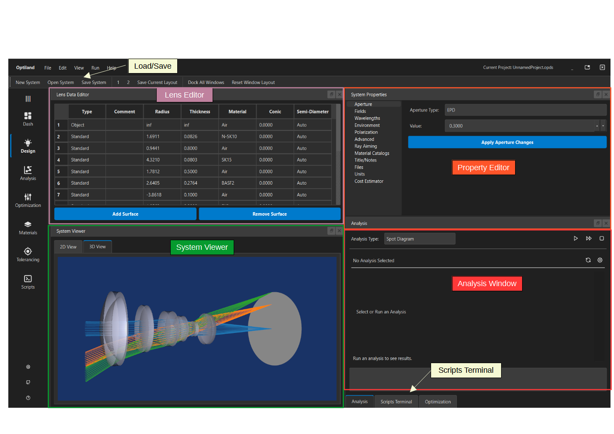
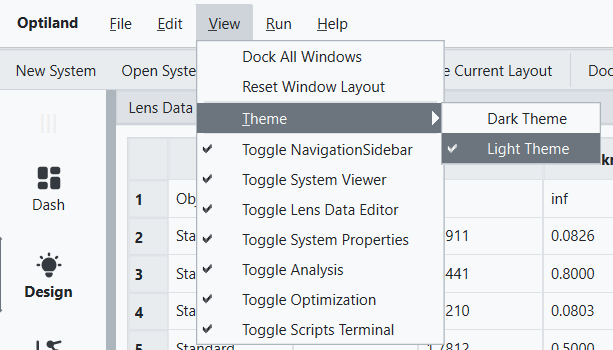

.. _gui_quickstart:

Optiland GUI Quickstart
=======================

Welcome to the Optiland Graphical User Interface (GUI)! This guide will help you get started with the basic features for interactive optical design and analysis.

What can the GUI do?
--------------------

The Optiland GUI provides a user-friendly way to:

*   Create new optical systems from scratch.
*   Save and load optical systems in Optiland's native JSON format.
*   Visually inspect optical systems in 2D and 3D.
*   Edit system parameters, including surface data (radius, thickness, material, etc.), aperture, field points, and wavelengths.
*   Run various optical analyses (e.g., ray fans, spot diagrams, MTF).
*   View analysis results graphically.
*   Access an embedded Python terminal for advanced scripting and automation.

Note that not all features available in the Optiland Python API are exposed in the GUI, but many common tasks are easily accessible. New features are continuously being added,
so keep an eye on future updates for more functionality.

Launching the GUI
-----------------

You can launch the Optiland GUI in a couple of ways:

1.  **From the command line (recommended for most users):**
    Open your terminal or console and type:

    .. code-block:: bash

       optiland

    This command will start the main application window. If you have installed Optiland correctly, this should work seamlessly.

2.  **From Python (useful for development or troubleshooting):**
    Open your terminal or console and type:

    .. code-block:: bash

       python -m optiland_gui.run_gui

Main Interface Components
-------------------------

When you first open the Optiland GUI, you'll see a main window containing several panels. Here's a brief overview:

*   **Main Window**: Contains the main menu bar (File, Edit, View, Tools, Help), toolbars for quick actions, and manages the different panels.
*   **Lens Data Editor**: This is where you view and modify the surface-by-surface data of your optical system, such as radius, thickness, material, conic constants, and semi-diameters. Changes made here are reflected in other panels.

    .. image:: _static/gui_lens_data_editor.png
       :alt: Viewer Panel (2D/3D)
       :align: center
       :width: 600px

*   **Viewer Panel**: This panel provides visual representations of your optical system.

    *   **2D View**: Shows a 2D cross-section of the lens, with options to display rays.
    *   **3D View**: Renders a 3D model of the system (if VTK is installed and working).

    .. image:: _static/gui_viewer_panel.png
       :alt: Viewer Panel (2D/3D)
       :align: center
       :width: 600px

*   **Analysis Panel**: Allows you to select, configure, and run various optical analyses. Results are typically displayed as plots within this panel. Note that you can run several analyses, each of which can be accessed using the numbered tabs on the right sidebar.

    .. image:: _static/gui_analysis_panel.png
       :alt: Analysis Panel
       :align: center
       :width: 600px

*   **System Properties Panel**: Manage system-wide settings that are not tied to individual surfaces. This includes:

    *   **Aperture**: Define the system aperture (e.g., Entrance Pupil Diameter, F-number).
    *   **Fields**: Set up field points for analysis.
    *   **Wavelengths**: Define the wavelengths and their weights for calculations.

    .. image:: _static/gui_system_properties.png
       :alt: System Properties Panel
       :align: center
       :width: 600px

*   **Sidebar**: Located on the left, it provides quick navigation to show/hide the main panels like Lens Editor, Viewer, Analysis, etc.
*   **Python Terminal** (View > Python Terminal): An embedded IPython terminal for advanced users who want to interact with the optical system programmatically using Optiland's Python API.

.. note::

   All windows are dockable and can be rearranged to suit your workflow. You can also save your layout for future sessions. These can be loaded by pressing "1" or "2" in the top toolbar, corresponding to the slot used for saving your layout.

Light theme and Dark theme
--------------------------

The examples above show the default dark theme. If you prefer a light theme, you can easily switch to it under the **View > Theme** menu:

Getting Started: Basic Actions
------------------------------

Let's try a few basic operations.

1. Opening an Existing Lens File
~~~~~~~~~~~~~~~~~~~~~~~~~~~~~~~~

Optiland supports loading and saving its native JSON format (`.json`). Several samples files are included with the installation and can be found in the optiland/docs/samples directory. For this quickstart, we will load the Cooke Triplet lens system:

*   Go to the menu: **File > Open > Cooke_triplet.json**.
*   The Cooke Triplet lens system will load, and you should see its data in the Lens Editor and a 2D/3D representation in the Viewer Panel.

.. note::

   YOu can also load Optiland files that were saved using the Optiland Python API.

2. Viewing a Raytrace
~~~~~~~~~~~~~~~~~~~~~

With the Cooke Triplet loaded:

*   In the **Viewer Panel**, ensure the **2D View** tab is selected.
*   Experiment with the Matplotlib toolbar controls, such as zooming and panning.
*   Switch to the **3D View** tab in the Viewer Panel to see the lens and rays in 3D. You can rotate, pan, and zoom this view.

3. Changing a Surface Parameter
~~~~~~~~~~~~~~~~~~~~~~~~~~~~~~~

Let's modify a surface and see the update:

*   In the **Lens Editor Panel**, find the row for **Surface 1** (first surface after object).
*   Double-click on the cell containing its **Radius** value.
*   Change the value (e.g., from 22.0136 to 30.0) and press **Enter**.
*   Observe how the 2D and 3D views in the **Viewer Panel** update to reflect this change. The lens is now defocused.

4. Running an Analysis
~~~~~~~~~~~~~~~~~~~~~~

*   In the **Analysis Panel**, select **RMS Spot Size vs Field** from the list of available analyses. Or, choose another analysis if you prefer.
*   Click the triangular "Run" button to execute the analysis.
*   The results will be displayed in the Analysis Panel, showing a plot of RMS spot size against field angle.

Explore Further
---------------

This quickstart covered only the very basics. The Optiland GUI has many more features for detailed optical design and analysis. We encourage you to explore the menus, right-click options in different panels, and consult the other sections of the Optiland documentation for more in-depth information on specific functionalities.

.. note::

   For the latest and greatest features, the Optiland Python API generally must be used. The GUI does not currently expose all features available in Optiland.
