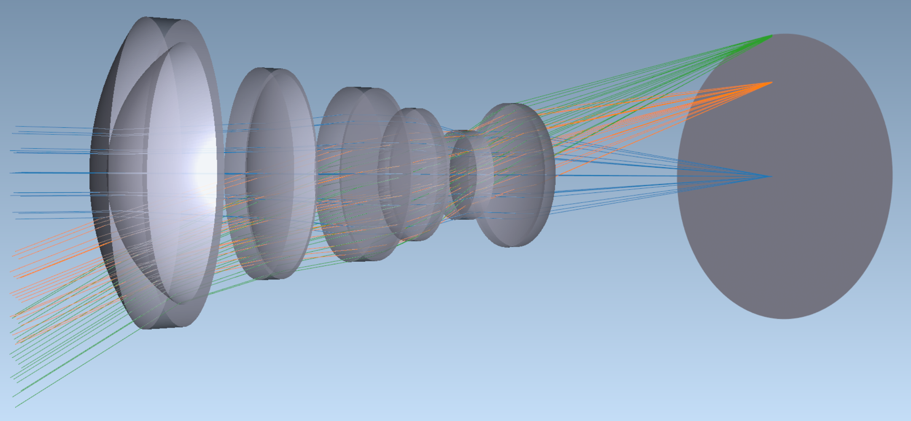

Welcome to Optiland's documentation!
====================================

.. note::

   This project is under active development.

**Optiland** is a Python‑based, open‑source framework for optical design, analysis, and optimization. Its clean, Pythonic API makes it easy to:

- Build, trace, and analyze lens and mirror systems (paraxial → real → polarization-aware)
- Perform paraxial, wavefront, PSF/MTF, and scattering analyses
- Optimize via local/global solvers or differentiable ML pipelines
- Visualize in 2D (matplotlib) and 3D (VTK)
- Extend with custom surfaces, coatings, optimization operands, and more

Under the hood, Optiland leverages **NumPy** for CPU‑bound tasks and **PyTorch** for GPU acceleration and autograd‑enabled workflows - so you get the best of both worlds.

|br|

Python code to generate this 3D visualization:

.. code:: python

   from optiland.samples.objectives import ReverseTelephoto

   lens = ReverseTelephoto()
   lens.draw3D()

Try it Now
----------

Use the interactive shell to try Optiland in your browser!
Note that loading the interactive shell may take a few seconds.

Not sure what to type in the shell? Here are a few ideas to explore Optiland right away:

.. code-block:: python

    lens.draw()  # Visualize the optical layout

.. code-block:: python

    effl = lens.paraxial.f2()  # Retrieve the effective focal length

.. code-block:: python

    # Trace 1024 random rays for the on-axis field point, then use rays.x, rays.y for intersection points
    rays = lens.trace(Hx=0, Hy=0, wavelength=0.55, num_rays=1024, distribution="random")

.. code-block:: python

    # Run a spot diagram analysis
    from optiland.analysis import SpotDiagram
    spot = SpotDiagram(lens)
    spot.view()

.. replite::
   :kernel: xpython
   :toolbar: True
   :width: 100%
   :height: 600px

   from optiland.samples.objectives import CookeTriplet

   lens = CookeTriplet()
   lens.draw()

.. note::

   3D plotting does not work in the interactive shell, but you can run the code in your local Python environment to try the 3D visualizations.

.. _getting_started:

.. toctree::
   :maxdepth: 1
   :caption: Getting Started

   installation
   quickstart
   cheat_sheet

.. toctree::
   :maxdepth: 2
   :caption: Core Functionalities

   functionalities

.. toctree::
   :maxdepth: 1
   :caption: Example Gallery

   gallery/introduction
   gallery/basic_lenses
   gallery/specialized_lenses
   gallery/reflective_systems
   gallery/analysis
   gallery/opd_psf_mtf
   gallery/optimization
   gallery/tolerancing
   gallery/freeforms
   gallery/differentiable_ray_tracing
   gallery/real_world_projects
   gallery/external_tools
   gallery/miscellaneous

.. _learning_guide:

.. toctree::
   :maxdepth: 1
   :caption: Learning Guide

   learning_guide

.. toctree::
   :maxdepth: 1
   :caption: Developer's Guide
   :numbered:

   developers_guide/introduction
   developers_guide/requirements
   developers_guide/installation
   developers_guide/getting_started
   developers_guide/architecture
   developers_guide/configurable_backend
   developers_guide/ray_overview
   developers_guide/surface_overview
   developers_guide/geometry_overview
   developers_guide/analysis_framework
   developers_guide/optimization_framework
   developers_guide/tolerancing_framework
   developers_guide/visualization_framework
   developers_guide/optiland_file_format

.. toctree::
   :maxdepth: 1
   :caption: Contributing

   contributing

.. toctree::
   :maxdepth: 1
   :caption: API Reference

   api/api_introduction
   api/api_analysis
   api/api_coatings
   api/api_core
   api/api_fileio
   api/api_geometries
   api/api_materials
   api/api_wavefront
   api/api_optic
   api/api_optimization
   api/api_paraxial
   api/api_physical_apertures
   api/api_rays
   api/api_raytrace
   api/api_solves
   api/api_surfaces
   api/api_tolerancing
   api/api_visualization
   api/api_zernike

.. toctree::
   :maxdepth: 1
   :caption: Authors

   authors

.. toctree::
   :maxdepth: 1
   :caption: License

   license

.. toctree::
   :maxdepth: 1
   :caption: References

   references

.. |br| raw:: html

       
