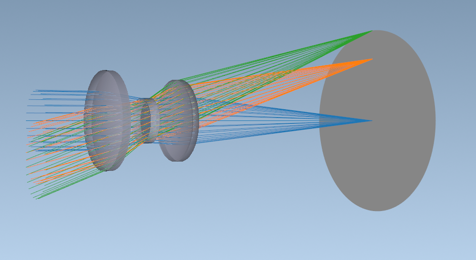

Quickstart
==========

.. _first_script:

Once you have installed Optiland, you can start designing and analyzing optical systems. Here is a simple example which loads and visualizes a Cooke Triplet lens system.

Optiland "Hello, World"
-----------------------

.. code-block:: python

   from optiland.samples.objectives import CookeTriplet

   lens = CookeTriplet()
   lens.draw3D()

   This shows the resulting 3D visualization of the Cooke triplet lens system.

Running the GUI
---------------

Optiland includes a Graphical User Interface (GUI) for interactive design and analysis. Once the package is installed, you can launch the application from any terminal or console on your system by simply running the command:

.. code-block:: bash

   optiland

This will start the main application window. For development or troubleshooting, you can also run the GUI module directly using Python's ``-m`` flag:

.. code-block:: bash

   python -m optiland_gui.run_gui

For a more detailed guide on using the GUI, including an overview of its components and basic operations, please see the :ref:`gui_quickstart`.

Optiland for Beginners
----------------------

This script is the first of the learning guide series. It introduces the basic concepts of Optiland and demonstrates how to create a simple lens system.

.. toctree::
   :maxdepth: 1
   :titlesonly:

   Optiland for Beginners <examples/Tutorial_1a_Optiland_for_Beginners>
