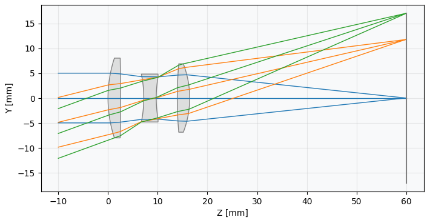
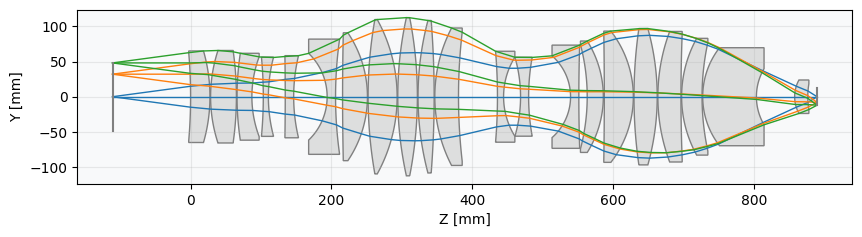
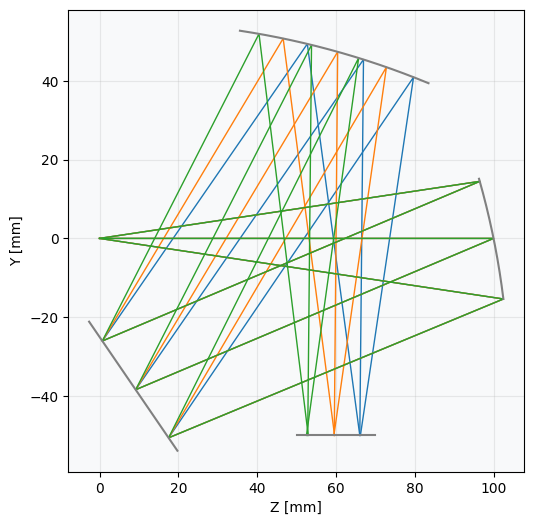

# Summary

**Optiland** is an open-source optical design package written in Python. It offers a comprehensive platform for the design, analysis, and optimization of complex optical systems, catering to a wide audience from professional engineers and researchers to students and hobbyists. Optiland handles a wide range of optical systems, from classical refractive and reflective designs to advanced freeform and computational optics.

Core features include sequential ray tracing, a rich library of surface types (spherical, aspheric, freeform), optimization and tolerancing support, and a suite of analysis tools for evaluating optical performance (e.g., spot diagrams, wavefront analysis, modulation transfer function). A key feature of Optiland is its dual-backend architecture, which allows users to switch between a NumPy [@harris2020array] backend for fast CPU computations and a PyTorch [@NEURIPS2019_9015] backend for GPU acceleration and automatic differentiation. This enables the integration of Optiland with machine learning workflows and gradient-based optimization, as all calculations are differentiable. Optiland also includes a graphical user interface (GUI) for interactive design and analysis.

# Statement of Need

The field of optical design has long been dominated by commercial software tools such as OpticStudio [@zemax] and CodeV [@codev], which are powerful but expensive and proprietary. Licenses often cost tens of thousands of dollars, creating a significant barrier to entry for students, educators, and researchers.

Optiland addresses this need by providing a comprehensive open-source optical design package that unifies traditional lens design with modern, differentiable workflows. It enables a wide range of optical design, analysis, and optimization tasks that previously required costly commercial software. The differentiable PyTorch backend is particularly relevant for computational optics and machine learning-driven design, where novel optimization and inverse-design approaches are increasingly important. For example, optical systems modeled in Optiland can be embedded into deep learning pipelines and trained end-to-end using backpropagation, enabling tasks such as lens design via learned generative models.

The PyTorch backend also provides substantial performance improvements through GPU acceleration. In practice, ray tracing workloads that can take minutes on a CPU are reduced to seconds on a modern GPU, and the speedups scale with both hardware quality and problem size. This level of acceleration enables experiments that would otherwise be impractical, such as large-scale Monte Carlo tolerancing, high-resolution simulations, or gradient-based inverse design. By combining a flexible and fully differentiable architecture with strong performance and a rich feature set, Optiland aims to democratize access to advanced optical design tools.

Several open-source optical packages exist, such as Prysm [@dube2019prysm], which provides advanced physical optics propagation and diffraction modeling, and RayOptics [@RayOptics], which offers Python-based ray-tracing and lens analysis. Optiland complements these efforts by combining ray tracing, optimization, tolerancing, and differentiable machine-learning integration into a single, comprehensive platform. Optiland is not intended to replace mature commercial tools in every respect (e.g., non-sequential ray tracing, coating optimization, CAD integration), but instead provides an open, extensible framework for research and education in lens/system design.

# Functionalities

Optiland supports a wide range of design, analysis, and optimization tasks, making it suitable for both classical optical engineering and modern computational applications. Its main capabilities include:

- **Design Tools**: Sequential ray tracing, lens system modeling (spherical, conic, aspheric, freeform surfaces), and flexible aperture/field/wavelength configurations.
- **Analysis Tools**: Spot diagrams, wavefront analysis, OPD maps, polarization ray tracing, PSF/MTF evaluation, and scattering models.
- **Optimization and Tolerancing**: Gradient-based and global optimization, Monte Carlo tolerancing, parametric sweeps, and specialized glass selection tools.
- **Differentiable Ray Tracing**: A fully differentiable backend via PyTorch enables gradient-based optimization and integration with machine learning frameworks.
- **Material Database**: Built-in refractive index library with support for user-defined materials.
- **Visualization**: 2D layout plots, 3D ray-trace visualization, and an interactive GUI.
- **Interoperability**: Import of Zemax OpticStudio files, JSON-based I/O, and a full Python API.
- **Performance**: GPU acceleration with PyTorch and CPU acceleration with Numba.

# Example

The following examples demonstrate how to use Optiland, starting with a simple system definition, then optimization, and finally machine-learning integration with PyTorch.

## 1. Defining a simple optical system - The Cooke Triplet

```python
import numpy as np
from optiland import optic

# Create empty Optic instance
lens = optic.Optic()

# Define lens surfaces
lens.add_surface(index=0, radius=np.inf, thickness=np.inf)  # Object plane
lens.add_surface(index=1, radius=+22.01359, thickness=3.25896, material="SK16")
lens.add_surface(index=2, radius=-435.7604, thickness=6.00755)
lens.add_surface(index=3, radius=-22.21328, thickness=0.99997, material=("F2", "schott"),)
lens.add_surface(index=4, radius=+20.29192, thickness=4.75041, is_stop=True)
lens.add_surface(index=5, radius=+79.68360, thickness=2.95208, material="SK16")
lens.add_surface(index=6, radius=-18.39533, thickness=42.2077)
lens.add_surface(index=7)

# Add an aperture
lens.set_aperture(aperture_type="EPD", value=10)

# Add fields
lens.set_field_type(field_type="angle")
lens.add_field(y=0)
lens.add_field(y=14)
lens.add_field(y=20)

# Add wavelengths
lens.add_wavelength(value=0.48)
lens.add_wavelength(value=0.55, is_primary=True)
lens.add_wavelength(value=0.65)

lens.update_paraxial()

# Visualize in 3D
lens.draw3D()
```


## 2. Optimizing the lens

```python
from optiland import optimization

# Define the optimization problem
problem = optimization.OptimizationProblem()

# Set all radii as variables
for k in range(1, lens.surface_group.num_surfaces - 1):
    problem.add_variable(lens, "radius", surface_number=k)

# Set all thicknesses as variables
problem.add_variable(lens, "thickness", surface_number=1, min_val=2.5, max_val=5.0)
problem.add_variable(lens, "thickness", surface_number=2, min_val=4.0, max_val=8.0)
problem.add_variable(lens, "thickness", surface_number=3, min_val=2.5, max_val=5.0)
problem.add_variable(lens, "thickness", surface_number=4, min_val=4.0, max_val=8.0)
problem.add_variable(lens, "thickness", surface_number=5, min_val=2.5, max_val=5.0)
problem.add_variable(lens, "thickness", surface_number=6, min_val=40, max_val=50)

# RMS spot size operand - to be minimized
for field in lens.fields.get_field_coords():
    input_data = {
        "optic": lens,
        "surface_number": 7,
        "Hx": field[0],
        "Hy": field[1],
        "num_rays": 11,
        "wavelength": 0.587,
        "distribution": "uniform",
    }
    problem.add_operand(
        operand_type="rms_spot_size",
        target=0.0,
        weight=10,
        input_data=input_data,
    )

# Total track operand
input_data = {'optic': lens}
problem.add_operand("total_track", max_val=60, weight=1, input_data=input_data)

# Optimize
optimizer = optimization.OptimizerGeneric(problem)
optimizer.optimize()
lens.draw()
```



The result can be refined further using Optiland's GlassExpert functionality to automatically choose high-quality glass candidates.

## 3. Switching to the PyTorch backend

Optiland’s API is identical across backends. Switching to PyTorch enables gradient tracking and GPU acceleration.

```python
import optiland.backend as be
be.set_backend("torch")      # Use the PyTorch backend
be.set_precision("float32")  # Set precision of calculations
be.grad_mode.enable()        # Enable gradient tracking
be.set_device("cuda")        # Use CUDA (GPU)
```

## 4. End-to-end optimization with PyTorch

The PyTorch backend allows integration with neural networks and gradient-based optimizers. Note that to enable this functionality, the lens should be built when the PyTorch backend is active.

```python
import torch
from optiland.ml import OpticalSystemModule

# Wrap the lens system and optimization problem in a PyTorch module
model = OpticalSystemModule(lens, problem)

# Define PyTorch optimizer
optimizer = torch.optim.Adam(model.parameters(), lr=0.1)

losses = []
for step in range(250):
    optimizer.zero_grad()
    loss = model()      # lens merit function
    loss.backward()
    optimizer.step()
    model.apply_bounds()
    losses.append(loss.item())
```

This workflow enables research scenarios such as inverse design, generative modeling, and end-to-end optical design.

# Research Enabled by Optiland

Optiland is actively used by researchers in the **MReye group** at the Leiden University Medical Center. It serves as a configurable backend for all optical computations within the [Visisipy](https://github.com/MReye-LUMC/visisipy) [@visisipy-zenodo] project, a Python library for simulating visual optics.

# Figures





# Acknowledgements

The authors thank Jan-Willem Beenakker for initiating the collaboration that led to the integration of Optiland into Visisipy. We also thank contributors and community members for feedback and code contributions, in particular Seçkin Berkay Öztürk, Hemkumar Srinivas, Matteo Taccola, Corentin Nannini, Kacper Rutkowski, and David Fariña.

The contributions of Corné Haasjes are part of the OPENOPTICS project with project number SD23.2.004 of the Open Science Fund, which is financed by the Dutch Research Council (NWO).

# References