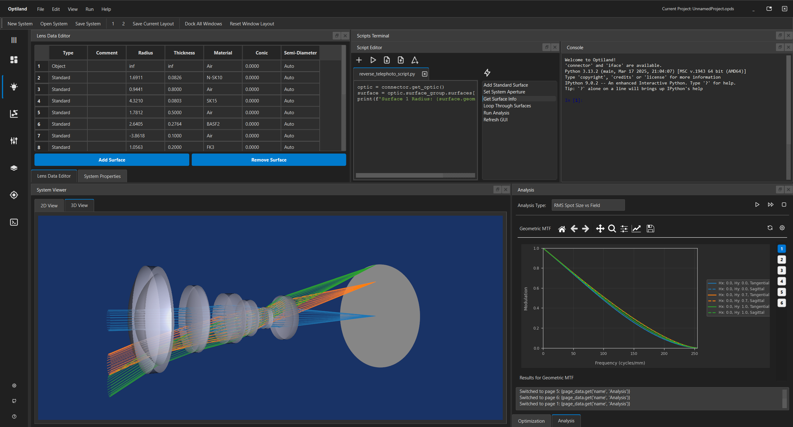

# Summary

**Optiland** is an open-source optical design software written in Python. It offers a comprehensive platform for the design, analysis, and optimization of optical systems, catering to a wide audience from students and hobbyists to professional engineers and researchers. The software supports a variety of optical systems, including traditional refractive and reflective designs, as well as modern freeform and computational optics.

Core features include sequential ray tracing, a rich library of surface types (spherical, aspheric, freeform), optimization and tolerancing support, and a suite of analysis tools for evaluating optical performance (e.g., spot diagrams, wavefront analysis, modulation transfer function). A key feature of Optiland is its dual-backend architecture, which allows users to switch between a NumPy backend for fast CPU computations and a PyTorch backend for GPU acceleration and automatic differentiation. This enables the integration of Optiland with machine learning workflows and gradient-based optimization, as all calculations are differentiable. The software also includes a graphical user interface (GUI) for interactive design and analysis.

# Statement of Need

The field of optical design has long been dominated by commercial software tools that are often expensive and proprietary. This creates a significant barrier to entry for students, educators, and researchers, who often have limited access to the professional-grade tools required for optical design tasks. While several open-source alternatives exist, they often lack the comprehensive feature set, modern architecture, and performance required for research and industrial applications.

Optiland addresses this need by providing a flexible and feature-rich platform for optical design in Python. The differentiable PyTorch backend is particular relevant for computational optics and machine learning-driven design, where novel optimization and inverse-design approaches are increasingly important. For example, optical systems modeled in Optiland can be embedded into deep learning pipelines and trained end-to-end using backpropagation, enabling tasks such as lens design via learned generative models.

The PyTorch backend also provides significant performance gains through GPU acceleration. On typical modern hardware, GPU-accelerated ray tracing achieves speedups of 20-60x compared to CPU-bound NumPy computations, with greater gains possible on high-end or multi-GPU systems. This level of performance enables large-scale, gradient-based optimization and simulations for real-world research and development. By combining a modern architecture with strong performance and a rich feature set, Optiland aims to democratize access to advanced optical design tools.

# Usage and Examples

Optiland's API is consistent across its backends, allowing users to switch between NumPy and PyTorch with a single command. The following code demonstrates how to set the backend to PyTorch and enable gradient calculations, a crucial step for machine learning applications.

```python
import optiland.backend as be
be.set_backend("torch")  # Use the PyTorch backend
be.set_precision("float32")  # Set precision of calculations
be.grad_mode.enable()  # Enable gradient tracking
be.set_device("cuda")  # Use CUDA (GPU)
```

The example below illustrates a typical optimization workflow. The code defines a simple lens system, sets up an optimization problem to minimize the root-mean-square (RMS) spot size, and then performs the optimization using SciPy-based optimizers.

```python
import numpy as np
from optiland import optic, optimization

# Define the lens system
lens = optic.Optic()
lens.add_surface(index=0, thickness=np.inf)
lens.add_surface(index=1, thickness=7, radius=1000, material="N-SF11", is_stop=True)
lens.add_surface(index=2, thickness=30, radius=-1000)
lens.add_surface(index=3)

# Set aperture, field, and wavelength
lens.set_aperture(aperture_type="EPD", value=15)
lens.set_field_type(field_type="angle")
lens.add_field(y=0)
lens.add_wavelength(value=0.55, is_primary=True)

# Define the optimization problem
problem = optimization.OptimizationProblem()
input_data = {
    "optic": lens,
    "surface_number": -1,  # -1 indicates image surface
    "Hx": 0,               # Normalized field coordinate in x
    "Hy": 0,               # Normalized field coordinate in y
    "num_rays": 5,
    "wavelength": 0.55,
    "distribution": "hexapolar",
}

# Add RMS spot size operand
problem.add_operand(
    operand_type="rms_spot_size",
    target=0,
    weight=1,
    input_data=input_data,
)

# Add variables to be optimized
problem.add_variable(lens, "radius", surface_number=1)
problem.add_variable(lens, "radius", surface_number=2)

# Run the optimization
optimizer = optimization.OptimizerGeneric(problem)
optimizer.optimize()
```

# Research Enabled by Optiland

Optiland is actively used by researchers in the **MREYE group** at the Leiden University Medical Center. It serves as a configurable backend for all optical computations within the [Visisipy](https://github.com/MREYE-LUMC/visisipy) project, a Python library for simulating visual optics.

# Figures



# Acknowledgements

Development of Optiland was inspired by the needs of researchers and engineers working across optics, machine learning, and physics. The author would like to thank all contributors who have helped shape Optiland. The author also thanks the contributors to PyTorch, SciPy, NumPy, as well as the MREYE Lab in Leiden for early adoption, feedback, and collaboration.

# References